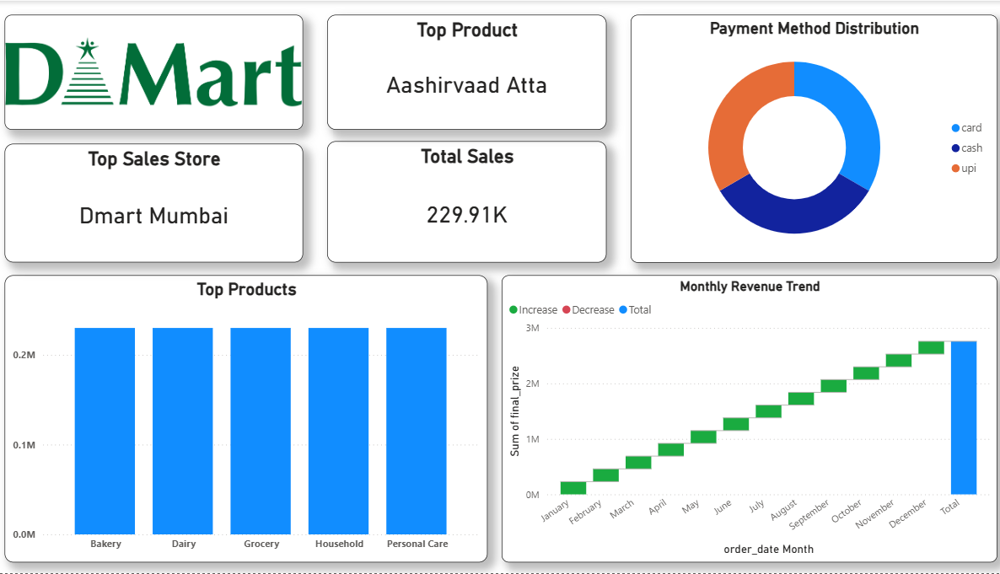

# DMART Project

A data analytics project simulating DMART operations, including raw data, cleaning scripts, MySQL integration, and dashboards.

---

## Project Structure

Raw Data Files (CSV)
   ↓
Data Cleaning Scripts (Python)
   ↓
MySQL Database
   ↓
SQL Queries & Analysis
   ↓
Power BI / Superset Dashboards
   ↓
Business Insights & Reports

## Dashboard Preview



##📊 Dashboard Insights Summary

1️⃣ Sales are growing every month

DMart sales keep increasing from January to December, which is a good sign for the business.

2️⃣ Aashirvaad Atta sells the most

Customers buy Aashirvaad Atta more than any other product.

3️⃣ Mumbai store earns the highest sales

The Mumbai store performs better than all other stores.

4️⃣ People like digital payments

Many customers pay using UPI and cards, not only cash.

---

## Setup Instructions

1. **Clone the repository**:

```bash
git clone https://github.com/KrushnaP24/DMART_PROJECT.git
cd DMART_PROJECT

python -m venv .venv
.venv\Scripts\activate   # Windows

# or for Linux/Mac: source .venv/bin/activate
pip install -r requirements.txt


